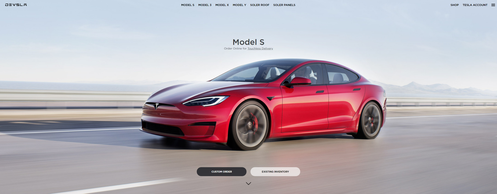

  
  
  

<h4 align="center"> 
	🚧 Devsla - Concluído 🚀 🚧
</h4>

## Sobre o projeto

Projeto prático de estudo desenvolvido com o intuito de aplicar meus conhecimentos de **HTML5, CSS3 e Responsividade**

---

## Projeto desenvolvido

---
